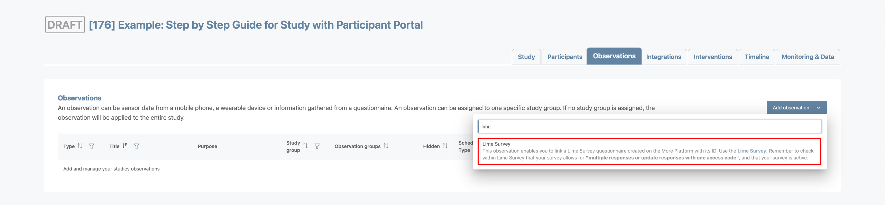
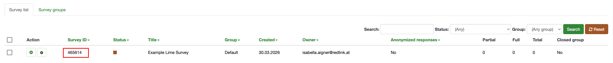
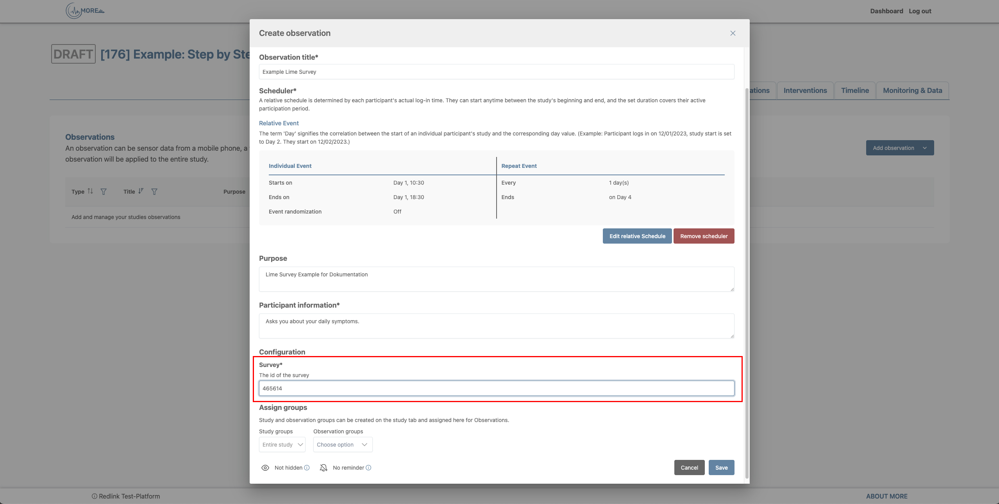
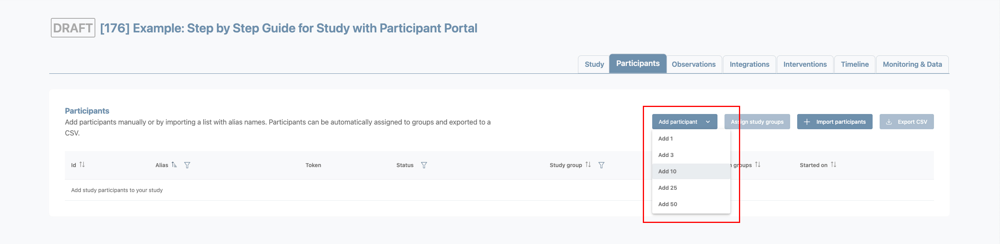
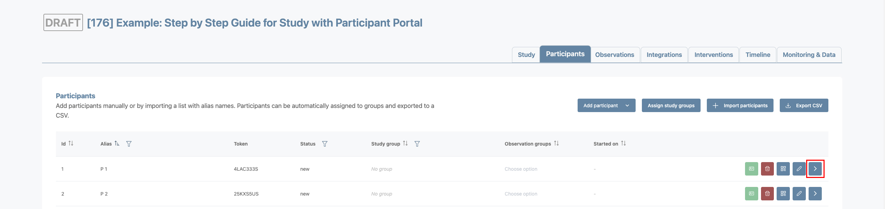
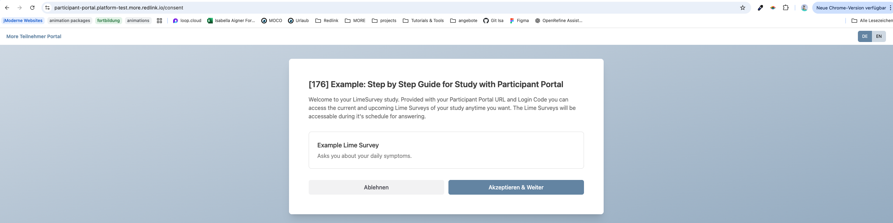
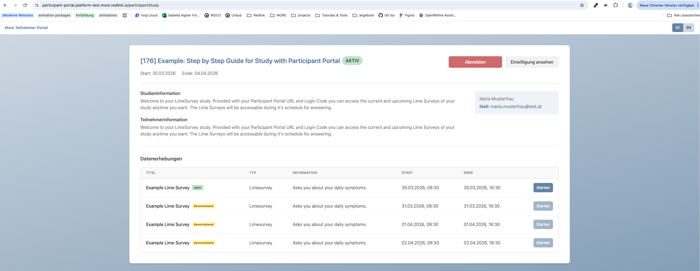

# User Documentation: Conduct a MORE Study without the App

## Description of the Use Case
Given a simple study where participants only need to complete a single LimeSurvey questionnaire, requiring them to download and install the MORE App can introduce unnecessary overhead.

For this reason, MORE provides a mode that allows researchers to provide participants with a URL and login code so they can complete questionnaires directly in the browser.

---

## Workflow Overview
For LimeSurvey-based studies, participants use the Participant Portal (a lightweight web application) instead of the MORE mobile app. The Participant Portal provides a simple login process including consent handling and access to assigned LimeSurvey questionnaires.

The following workflow describes how to prepare and provide Participant Portal access for participants in LimeSurvey-based studies.

### StudyManager Frontend – Study Administrator / Operator
1. **Activate Participant Portal usage** for a specific study.
2. **Create and configure the required LimeSurvey questionnaire(s)** in the MORE LimeSurvey environment.
3. **Create Limesurvey observations** in the StudyManager Frontend and **link them to** the corresponding **LimeSurvey questionnaires**.
4. **Create participants** in the participant list.
5. **Open the new Participant Dialog** via the action button or by selecting a participant row in the table.
6. **Generate the participant-specific URL and login code** inside the dialog.
7. Provide the generated URL and login code to the participant.

### Participant Portal Access - Participant:
1. The participant **receives the URL and login code** from the Study Administrator or Operator.
2. The participant **opens the provided link**, which leads to the Participant Portal login page.
3. The participant **enters the login code** and is authenticated.
4. On first login, the participant must **accept the consent form**.
5. After authentication, the participant can **access study information and the list of assigned LimeSurvey questionnaires**.

Each questionnaire link becomes available only when the corresponding LimeSurvey observation schedule is active. Selecting a questionnaire automatically redirects the participant to the corresponding LimeSurvey interface for completion.

Repository: https://github.com/MORE-Platform/more-participant-portal

## Step-by-Step Guide

### Activate Participant Portal usage for the Study (StudyManager Frontend)
1. Open your study inside the StudyManager Frontend.
2. On the Study Details page enable the participant portal option.

### Configure Limesurvey Questionnaires
1. Go to the [More Limesurvey Survey](https://lime.platform-test.more.redlink.io/admin/)
2. Login to the Limesurvey Survey
3. Follow the instructions on the [More Limesurvey Documentation](https://github.com/MORE-Platform/more-limesurvey) (more-limesurvey repository).

### Create and link Observation(s) to LimeSurvey Questionnaire(s)
1. Open the Observation Page on the StudyManager Frontend
2. Click "Add Observation" and choose "Lime Survey" from the List

3. Enter the observation details and configure the schedule.
4. For the Survey ID copy the ID from the Limesurvey Survey and enter it in the dialog to link them together.

5. Save the observation.

### Create participant(s) and generate Participant Portal Access Credentials
1. Go to the Participant Page on the StudyManager Frontend
2. Click "Add Participant" and choose the number of participants you want to create.

3. Open the Participant Dialog.

4. Click "Generate access" to get Login URL and Code for the participant

5. Provide the participant with their access credentials.

## Using the Participant Portal

### Access the Participant Portal
1. Open the participant portal link in the browser and enter the login code.

2. Accept the consent form (first login only).

### View Study Information and Access the Lime Survey Questionnaire(s)
1. Once logged in, participants can access study information and view a list of current and upcoming questionnaires.

2. An active questionnaire can be accessed via the action button inside the table.

Note: Questionnaires are only available while their corresponding observation schedule is active.
