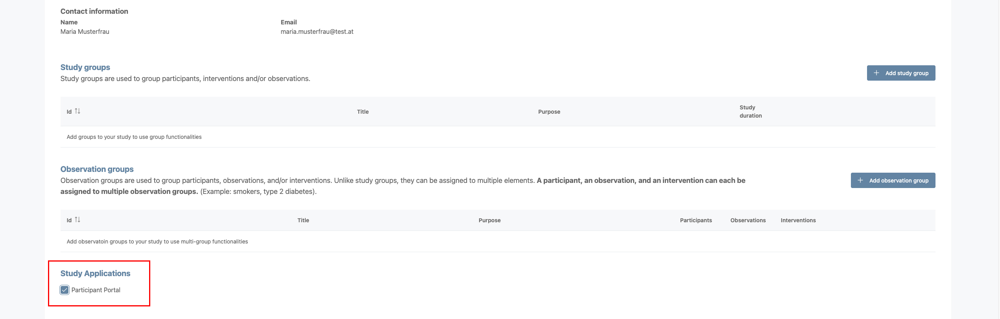
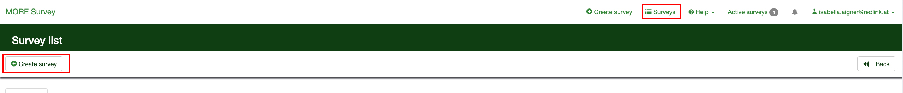
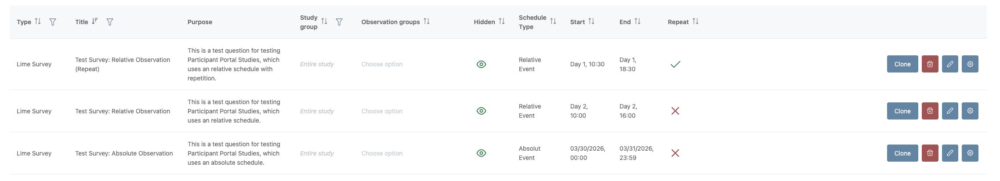
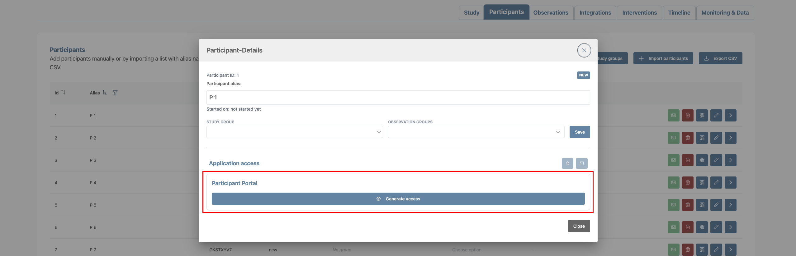
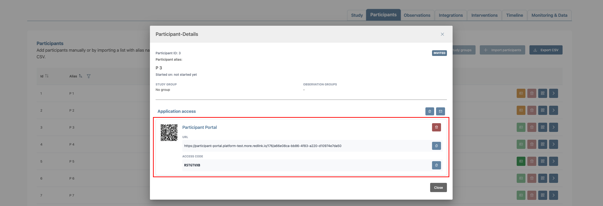
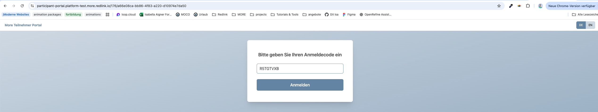
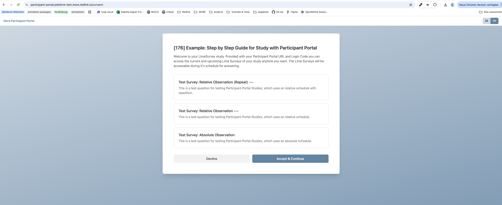
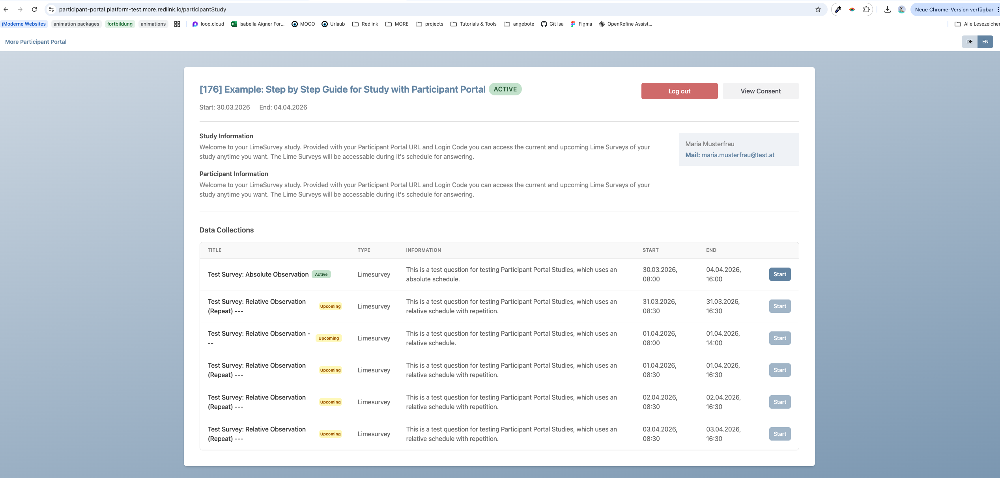
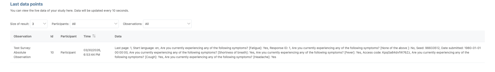
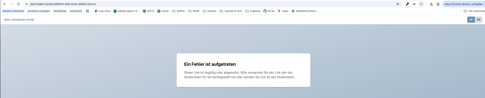

# Manual End-to-End Test: Conduct a MORE Study without the App

## Purpose
This manual end-to-end test verifies the complete feature flow for conducting a MORE study without using the mobile app.

### Scope

| Test includes                                                                                                     | Test excludes                    | Systems infovled            |
|-------------------------------------------------------------------------------------------------------------------|----------------------------------|-----------------------------|
| Study configuration in the More StudyManager                                                                      | More mobie app functionaities    | Study Manager Frontend      |
| Lime Survey questionnaire configuration on the More Lime Server                                                   | non-LimeSurvey observation types | Study Manager Backend       |
| Creation of Lime Survey Observation and linkage to created Lime Survey questionnaire (with 3 different schedules) | automated API-level verification | More Gateway (for requests) |
| Creation of Participant and generation of Participant Portal Access Credetials                                    |                                  | More Lime Survey Server     |
| Login and Authentication at the Participant Portal                                                                |                                  | Participant Portal          |
| Visibility of said questionnaires in the Participant Portal                                                       |                                  |                             |
| Redirect and completion of the Lime Survey questionnaire                                                          |                                  |                             |
| Preview of the Lime Survey questionnaire Data in the StudyManager                                                 |                                  |                             |

---

# Test Metadata

Fill in the following template with the values for your test

| Parameter                                 | Value                                                                       |
|-------------------------------------------|-----------------------------------------------------------------------------|
| Environment                               | Redlink More Test Instance                                                  |
| StudyManager URL                          | https://studymanager.platform-test.more.redlink.io/ (update for local test) |
| LimeSurvey URL                            | https://lime.platform-test.more.redlink.io/admin/  (update for local test)  |
| Tester                                    |                                                                             |
| Test date                                 |                                                                             |
| Study ID                                  |                                                                             |
| Participant ID                            |                                                                             |
| Participant Potal Link                    |                                                                             |
| Participant Portal Code                   |                                                                             |
| Survey ID / Absolute Observation          |                                                                             |
| Survey ID / Relative Observation          |                                                                             |
| Survey ID / Relative Observation (Repeat) |                                                                             |

## Preconditions

| <input type="checkbox">  Local Setup                                                                                                                         | <input type="checkbox">  Test instance setup                                                                                  |
|--------------------------------------------------------------------------------------------------------------------------------------------------------------|-------------------------------------------------------------------------------------------------------------------------------|
| <input type="checkbox">  More Studymanager Backend and More Gateway are running in the docker (with correct env variables)                                   | <input type="checkbox">  The Studymanager Frontend/Backend and Participant Portal are deployed and reachable (latest version) |
| <input type="checkbox">  More Studymanager Frontend and the Participant Portal are started via dev:local and reachable under localhost:3000 & localhost:3001 | <input type="checkbox">  The More Gateway is reachable                                                                        |
| <input type="checkbox">  Lime Survey Server is running and reachable under localhost:8085                                                                    | <input type="checkbox">  The tester can login and create a new Study                                                          |
| <input type="checkbox">  The tester can login and create a new Study                                                                                         |                                                                                                                               |
---

# Phase 1: Create and Configure your study

## 1. Create a new study

### Action
Open the [More StudyManager Frontend](https://studymanager.platform-test.more.redlink.io/) and create a new study with following information (updated values marked with _red_):

| Field                     | Value                                                                                                                                                                                                                                                                                                                      |
|---------------------------|----------------------------------------------------------------------------------------------------------------------------------------------------------------------------------------------------------------------------------------------------------------------------------------------------------------------------|
| Study title               | [_studyId_] DD.MM.YYYY: Manual Feature Test: Conduct Study Without App                                                                                                                                                                         |
| Study Start               | _Current Day_                                                                                                                                                                                                                                                                        |
| Study End                 | _In 7 Days_                                                                                                                                                                                                                                                                          |
| Purpose                   | Feature-Test study for **"Conduct a study without using the more app"**, DD.MM.YYYY                                                                                                                                                                                                                                        |
| Participant information   | Welcome to your LimeSurvey study. Provided with your Participant Portal URL and Login Code you can access the current and upcoming Lime Surveys of your study anytime you want. The Lime Surveys will be accessable during it's schedule for answering. This is a test study to test the feature of the participant portal |
| Consent configuration     | You agree to all terms and services needed to conduct this test-study for the feature: **Conduct a study without using the more app.**                                                                                                                                                                                     |
| Contact Information Name  | _Name of the Tester_                                                                                                                                                                                                                                                                 |
| Contact Information Email | _Email of the Tester_                                                                                                                                                                                                                                                            |

### Expected result
- Study is saved succesible and visible on Top of the Studylist.
- The Tester as the creator has all 3 roles: Study Administrator, Study Viewer, Study Operator.
- Clicking on the row with the study opens the study details page with all entered study information.

### Status

| Pass                    | Fail                    | Notes |
|-------------------------|-------------------------|-------|
| <input type="checkbox"> | <input type="checkbox"> |       |

---

## 2. Enable Participant Portal Usage

### Action
1. Scroll down on the study details and check the **Participant Portal** checkbox. It should save automatically.

### Expected Result
- After checking the Participant Portal checkbox, it will be checked even if you reload the page.

### Status

| Pass                    | Fail                    | Notes |
|-------------------------|-------------------------|-------|
| <input type="checkbox"> | <input type="checkbox"> |       |

---

## 3. Configure LimeSurveys

1. Go to the [More Lime Survey Server](https://lime.platform-test.more.redlink.io/admin/) and go to Survey and Login
2. Configure the Setup based on the [Lime Survey Documentation](https://github.com/MORE-Platform/more-limesurvey):
3. Go to **Surveys** and click **+ Create Survey**

4. Create the following 3 Surveys:

#### Lime Survey Configurations

| Data               | Lime Survey #1                                                                                   | Lime Survey #2                                                                                   | Lime Survey #3                                                                                                                                        |
|--------------------|--------------------------------------------------------------------------------------------------|--------------------------------------------------------------------------------------------------|-------------------------------------------------------------------------------------------------------------------------------------------------------|
| **Title**          | Test Survey: Absolute Observation                                                                | Test Survey: Relative Observation                                                                | Test Survey: Relative Observation (Repeat)                                                                                                            |
| **Question group** | Multiple choice: Symptoms                                                                        | Single choice: General well-being question                                                       | Single choice: Activity                                                                                                                               |
| **Description**    | This is a test question for testing Participant Portal Studies, which uses an absolute schedule. | This is a test question for testing Participant Portal Studies, which uses an relative schedule. | This is a test question for testing Participant Portal Studies, which uses an relative schedule with repetition.                                      |
| **Question type**  | Multiple Choice                                                                                  | Single Choice                                                                                    | Single Choice                                                                                                                                         |
| **Question**       | Are you currently experiencing any of the following symptoms?                                    | How would you rate your overall health today?                                                    | How physically active were you today?                                                                                                                 |
| **Answers**        | ☐ Fever ☐ Cough ☐ Headache ☐ Fatigue ☐ Shortness of breath ☐ None of the above                   | ☐ Very good ☐ Good ☐ Fair ☐ Poor ☐ Very poor                                                     | ☐ Not active ☐ Light activity (e.g., short walks) ☐ Moderate activity (e.g., cycling, longer walks) ☐ Intense activity (e.g., sports, workouts) 🚶‍♀️ |

### Status

| Pass                    | Fail                    | Notes |
|-------------------------|-------------------------|-------|
| <input type="checkbox"> | <input type="checkbox"> |       |

---

## 4. Create 3 Lime Survey Observations that Link to your Surveys

### Action
1. Go to the Studymanager Observation Page
2. Create three LimeSurvey Observations and configure their details as following:

| Field        | Observation #1                                                                                                                                                       | Observation #2                                                                                   | Observation #3                                                                                                   |
|--------------|----------------------------------------------------------------------------------------------------------------------------------------------------------------------|--------------------------------------------------------------------------------------------------|------------------------------------------------------------------------------------------------------------------|
| +*Title**    | Test Survey: Absolute Observation                                                                                                                                    | Test Survey: Relative Observation                                                                | Test Survey: Relative Observation (Repeat)                                                                       |
| **Schedule** | Absolute Scedule: Start: _Current Day_ 10:00 End: _Current Day + 1 Day_ 18:00, No Repeat | Relative Schedule: Start: Day 2 10:00, End: Day 2 16:00, No Repeat                               | Relative Schedule: Start: Day 1 10:30, End: Day 1 18:30; Repeat: every 1, End after 4                            |
| **Description** | This is a test question for testing Participant Portal Studies, which uses an absolute schedule.                                                                     | This is a test question for testing Participant Portal Studies, which uses an relative schedule. | This is a test question for testing Participant Portal Studies, which uses an relative schedule with repetition. |
| **SurveyID** | Enter Survey ID of **Test Survey: Absolute Observation**                                                                                                             | Enter Survey ID of **Test Survey: Relative Observation**                                         | Enter Survey ID of **Test Survey: Relative Observation (Repeat)**                                                |

### Expected Result
- All three observations are saved and shown in the observaioon list.

### Status

| Pass                    | Fail                    | Notes |
|-------------------------|-------------------------|-------|
| <input type="checkbox"> | <input type="checkbox"> |       |

---

## 5. Create Participant and generate Participant Portal credentials

### Action
1. Go to Studymanager Participant Page
2. Create a new Participant
3. Open the Participant Dialog and click "Generate access" to get Login URL and Code for the participant

 

### Expected Result
- Participant is created and saved.
- Participant Portal Access is generated and shown in the Participant Dialog.

### Status

| Pass                    | Fail                    | Notes |
|-------------------------|-------------------------|-------|
| <input type="checkbox"> | <input type="checkbox"> |       |

---

## 6. Start the Study

### Action
1. Go to Study Overview Page
2. Change the Status to **Active** (Start Study)

## expected Result
- The Study successfully starts and is set to Active.

### Status

| Pass                    | Fail                    | Notes |
|-------------------------|-------------------------|-------|
| <input type="checkbox"> | <input type="checkbox"> |       |

---

# Phase 2: Conduct the Participant Test

## 7. Open Participant Portal

### Action
1. Copy the URL that was just generated
2. Paste it into your browser

### Expected Result
- Result Page loads correctly

### Status

| Pass                    | Fail                    | Notes |
|-------------------------|-------------------------|-------|
| <input type="checkbox"> | <input type="checkbox"> |       |

---

## 8. Authenticate participant and accept consent

### Action
1. Enter the login code.
2. At first login the consent screen appears.
3. Decline the consent form once.
4. Enter and login again and accept the consent form.

### Expected Result
- After login the participant is redirected to the consent form.
- When declining the consent form the participant is redirected back to the login page.
- When accepting the consent form the participant is redirected to the study overview page.

### Status

| Pass                    | Fail                    | Notes |
|-------------------------|-------------------------|-------|
| <input type="checkbox"> | <input type="checkbox"> |       |

---

## 9. Verify study information and observation visibility

### Action
1. At the study overview you now should see the study information on top.
2. Below there is a list of all active and upcoming Lime surveys.
3. Active Lime Surveys have an active start button. The rest should be disabled.

### Expected Result
- The study information is displayed.
- The absolute observation (Lime Survey #1) is visible.
- The relative observation (Lime Survey #2) is visible.
- The relative observation with repetition (Lime Survey #3) is visible multiple times.

### Status

| Pass                    | Fail                    | Notes |
|-------------------------|-------------------------|-------|
| <input type="checkbox"> | <input type="checkbox"> |       |

---

## 10. Open Questionnaires

### Action
1. Click on an active lime survey and follow the link to the lime survey questionnaire.
2. You can answer all questions for this specific lime survey there.

### Expected Result
- The participant is redirected to the correct Lime Survey questionnaire.
- The questionnaire opens successfully in the browser.

### Status

| Pass                    | Fail                    | Notes |
|-------------------------|-------------------------|-------|
| <input type="checkbox"> | <input type="checkbox"> |       |

---

## 11. Verify that the Study Manager recieved the data

### Action
1. Open the Study Manager and navigate to the specific study the participant is in.
2. There go to the Monioring & Data Tab to check if the Lime Survey data was saved correctly.

Note: The Data can take a little bit to be saved into our system.

### Expected Result
- The Lime Survey data was saved correctly and is shown insede the Monitoring & Data Tab.

### Status

| Pass                    | Fail                    | Notes |
|-------------------------|-------------------------|-------|
| <input type="checkbox"> | <input type="checkbox"> |       |

---

## 12. Verify invalid login rejection

### Action
2. Open the same URL that was generated and enter a wrong login code.

### Expected Result
- The participant is redirected to the login page.
- The participant is informed that the login code is invalid.

### Status

| Pass                    | Fail                    | Notes |
|-------------------------|-------------------------|-------|
| <input type="checkbox"> | <input type="checkbox"> |       |

---

## 12. Verify invalid urls

### Action
1. Enter any url on the participant portal that is not a valid url.

### Expected Result
- The participant is redirected to an error page.

### Status

| Pass                    | Fail                    | Notes |
|-------------------------|-------------------------|-------|
| <input type="checkbox"> | <input type="checkbox"> |       |

---
