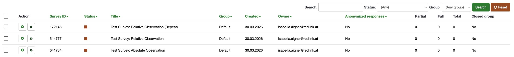

# Manual End-to-End Test: Conduct a MORE Study without using the MORE App

> ⚠️ This is the blueprint for the manual end-to-end test for "Conduct a MORE Study without the App". Before conducting the test copy this file and rename it to YYYY-MM-DD_Test_conduct-more-study-without-app.
> During the test you will fill out your copied version of this blueprint and enter the test metadata.

## Purpose
This manual end-to-end test verifies the complete feature flow for conducting a MORE study without using the mobile app.

### Scope

| Test includes                                                                                                     | Test excludes                    | Systems involved                     |
|-------------------------------------------------------------------------------------------------------------------|----------------------------------|--------------------------------------|
| Study configuration in the MORE StudyManager                                                                      | MORE mobile app functionalities  | Study Manager Frontend               |
| Lime Survey questionnaire configuration on the MORE Lime Server                                                   | Non-Lime Survey observation types | Study Manager Backend (for requests) |
| Creation of Lime Survey Observation and linkage to created Lime Survey questionnaire (with 3 different schedules) | Automated API-level verification | MORE Gateway (for requests)          |
| Creation of Participant and generation of Participant Portal Access Credentials                                   |                                  | MORE Limesurvey Server              |
| Login and Authentication at the Participant Portal                                                                |                                  | Participant Portal                   |
| Visibility of said questionnaires in the Participant Portal                                                       |                                  |                                      |
| Redirect and completion of the Lime Survey questionnaire                                                          |                                  |                                      |
| Preview of the Lime Survey questionnaire Data in the MORE StudyManager                                            |                                  |                                      |

---

## Preconditions

Choose one of the two setups to test the feature. Enter ✅ to mark the chosen path.

| Local Setup                                                                                                                            | Test instance setup                                                                                       |
|----------------------------------------------------------------------------------------------------------------------------------------|-----------------------------------------------------------------------------------------------------------|
| MORE StudyManager Backend and MORE Gateway are running in the docker (with correct env variables)                                      | The MORE StudyManager Frontend/Backend and Participant Portal are deployed and reachable (latest version) |
| MORE StudyManager Frontend and the Participant Portal are started via dev:local and reachable under localhost:3000 & localhost:3001    | The MORE Gateway is reachable                                                                             |
| Lime Survey Server is running and reachable under localhost:8085                                                                       | The tester can log in and create a new Study                                                              |
| The tester can log in and create a new Study                                                                                           |                                                                                                           |
---

## Test Metadata

Fill in the following metadata with the values for your test during Phase 1.

| Parameter                                 | Value                                                                       |
|-------------------------------------------|-----------------------------------------------------------------------------|
| Environment                               | Redlink MORE Test Instance                                                  |
| StudyManager URL                          | https://studymanager.platform-test.more.redlink.io/ (update for local test) |
| Lime Survey URL                            | https://lime.platform-test.more.redlink.io/admin/  (update for local test)  |
| Tester                                    |                                                                             |
| Test date                                 |                                                                             |
| Study ID                                  |                                                                             |
| Participant ID                            |                                                                             |
| Participant Portal Link                    |                                                                             |
| Participant Portal Code                   |                                                                             |
| Survey ID / Absolute Observation          |                                                                             |
| Survey ID / Relative Observation          |                                                                             |
| Survey ID / Relative Observation (Repeat) |                                                                             |

# Phase 1: Create and Configure your study

## 1. Create a new study

### Action
Open the [MORE StudyManager Frontend](https://studymanager.platform-test.more.redlink.io/) and create a new study with the following information (updated values marked like `this`):

| Field                     | Value                                                                                                                                                                                                                                                                                                                                                                        |
|---------------------------|------------------------------------------------------------------------------------------------------------------------------------------------------------------------------------------------------------------------------------------------------------------------------------------------------------------------------------------------------------------------------|
| Study title               | [`studyId`] `DD.MM.YYYY`: Manual Feature Test: Conduct Study Without App                                                                                                                                                                                                                                                                                                     |
| Study Start               | `Current Day`                                                                                                                                                                                                                                                                                                                                                                |
| Study End                 | `Current Day + 7 Days`                                                                                                                                                                                                                                                                                                                                                       |
| Purpose                   | Feature-Test study for **"Conduct a MORE Study without using the MORE App"**, `DD.MM.YYYY`                                                                                                                                                                                                                                                                                   |
| Participant information   | Welcome to your Lime Survey study. Using your Participant Portal URL and login code, you can access the current and upcoming Lime Survey questionnaires of your study at any time. The Lime Surveys will be accessible during their schedules for answering. This is a test study to test the conduction of a study together with the Participant Portal (without MORE App). |
| Consent configuration     | You agree to all terms and services needed to conduct this test study for the feature: **Conduct a MORE Study without using the MORE App.**                                                                                                                                                                                                                                  |
| Contact Information Name  | `Name of the Tester`                                                                                                                                                                                                                                                                                                                                                         |
| Contact Information Email | `Email of the Tester`                                                                                                                                                                                                                                                                                                                                                        |

### Expected result
- Study is saved successfully and visible on top of the Study List.
- The tester as the creator has all 3 roles: Study Administrator, Study Viewer, Study Operator.
- Clicking on the row with the study opens the Study Details Page with all entered study information.

### Status

| Completed | Notes   |
|----------|--------|
| ✅❌       |          |

---

## 2. Enable Participant Portal Usage

### Action
1. Scroll down on the Study Details Page and check the **Participant Portal** checkbox. It should save automatically.
> 

### Expected Result
- After checking the Participant Portal checkbox, it will stay checked even if you reload the page.

### Status

| Completed | Notes   |
|----------|--------|
| ✅❌       |          |

---

## 3. Configure Lime Surveys

1. Go to the [MORE Lime Survey Server](https://lime.platform-test.more.redlink.io/admin/) and log in to your account (log in credentials to local setup: admin / admin).
2. Configure the Setup based on the [Lime Survey Documentation](https://github.com/MORE-Platform/more-limesurvey)
3. Go to **Surveys** and click **+ Create Survey**
> 

4. Create the following 3 Surveys:

| Data                  | Lime Survey #1                                                                                   | Lime Survey #2                                                                                  | Lime Survey #3                                                                                                                                        |
|-----------------------|--------------------------------------------------------------------------------------------------|-------------------------------------------------------------------------------------------------|-------------------------------------------------------------------------------------------------------------------------------------------------------|
| **Title**             | Test Survey: Absolute Observation                                                                | Test Survey: Relative Observation                                                               | Test Survey: Relative Observation (Repeat)                                                                                                            |
| **Question group**    | Multiple choice: Symptoms                                                                        | Single choice: General well-being question                                                      | Single choice: Activity                                                                                                                               |
| **Group Description** | This is a test question for testing Participant Portal Studies, which uses an absolute schedule. | This is a test question for testing Participant Portal Studies, which uses a relative schedule. | This is a test question for testing Participant Portal Studies, which uses a relative schedule with repetition.                                       |
| **Question type**     | Multiple choice question -> Multiple choice                                                      | Single choice question -> List (radio)                                                          | Single choice question -> List (radio)                                                                                                                |
| **Question**          | Are you currently experiencing any of the following symptoms?                                    | How would you rate your overall health today?                                                   | How physically active were you today?                                                                                                                 |
| **Answers**           | ☐ Fever ☐ Cough ☐ Headache ☐ Fatigue ☐ Shortness of breath ☐ None of the above                   | ☐ Very good ☐ Good ☐ Fair ☐ Poor ☐ Very poor                                                    | ☐ Not active ☐ Light activity (e.g., short walks) ☐ Moderate activity (e.g., cycling, longer walks) ☐ Intense activity (e.g., sports, workouts) 🚶‍♀️ |

Note: if you copy the Answers and add it to quick add (one answer per line), it will automatically create your answers.

### Expected Result
- All 3 Surveys are created and saved in the Lime Survey Server.
> 

### Status

| Completed | Notes   |
|----------|--------|
| ✅❌       |          |

---

## 4. Create 3 Lime Survey Observations that Link to your Surveys

### Action
1. On the MORE StudyManager go to the Observations Tab of your study.
2. Click on **Add observation** to create three Lime Survey Observations and configure their details as follows:

| Field                                 | Observation #1                                                                                                                                              | Observation #2                                                                                    | Observation #3                                                                                                   |
|---------------------------------------|-------------------------------------------------------------------------------------------------------------------------------------------------------------|---------------------------------------------------------------------------------------------------|------------------------------------------------------------------------------------------------------------------|
| **Title**                             | Test Survey: Absolute Observation                                                                                                                           | Test Survey: Relative Observation                                                                 | Test Survey: Relative Observation (Repeat)                                                                       |
| **Schedule**                          | Absolute Schedule: Start: `Current Day` 10:00 End: `Current Day + 1 Day` 18:00  | Relative Schedule: Start: Day 2 10:00, End: Day 2 16:00, No Repeat                                | Relative Schedule: Start: Day 1 10:30, End: Day 1 18:30; Repeat: every 1 day, end after 4 repetitions                            |
| **Purpose / Participant Information** | This is a test question for testing Participant Portal Studies, which uses an absolute schedule.                                                            | This is a test question for testing Participant Portal Studies, which uses a relative schedule.   | This is a test question for testing Participant Portal Studies, which uses a relative schedule with repetition. |
| **SurveyID**                          | Enter Survey ID of **Test Survey: Absolute Observation**                                                                                                    | Enter Survey ID of **Test Survey: Relative Observation**                                          | Enter Survey ID of **Test Survey: Relative Observation (Repeat)**                                                |

### Expected Result
- All three observations are saved and shown in the observation list.
> 

### Status

| Completed | Notes   |
|----------|--------|
| ✅❌       |          |

---

## 5. Create Participant and generate Participant Portal credentials

### Action
1. Go to your Study Participants Page
2. Create a new Participant
3. Open the Participant Dialog and click "Generate access" to get Login URL and Code for the participant
> 
> 

### Expected Result
- Participant is created and saved.
- Participant Portal Access is generated and shown in the Participant Dialog.

### Status

| Completed | Notes   |
|----------|--------|
| ✅❌       |          |

---

## 6. Start the Study

### Action
1. Go to the Study Details Page
2. Change the Status to **Active** (Start Study)

### Expected Result
- The Study successfully starts and is set to Active.

### Status

| Completed | Notes   |
|----------|--------|
| ✅❌       |          |

---

# Phase 2: Conduct the Participant Study Test (Flow)

## 7. Open Participant Portal

### Action
1. Copy the URL that was just generated
2. Paste it into your browser

### Expected Result
- Result page loads correctly
> 

### Status

| Completed | Notes   |
|----------|--------|
| ✅❌       |          |

---

## 8. Authenticate participant and accept consent

### Action
1. Enter the login code.
2. Since it is the first login of the participant, the consent screen appears.
3. Decline the consent form once.
4. Enter and log in again and accept the consent form.

### Expected Result
- After login the participant is redirected to the consent form.
- When declining the consent form the participant is redirected back to the login page.
- When accepting the consent form the participant is redirected to the Participant Study Page.
> 

### Status

| Completed | Notes   |
|----------|--------|
| ✅❌       |          |

---

## 9. Verify study information and observation visibility

### Action
1. The Participant Study Page should now show the study information on top.
2. Below there is a list of all active and upcoming Lime surveys.
3. Only Lime Survey Questionnaires with an active schedule timeframe have an enabled start button. The rest should be disabled.

### Expected Result
- The study information is displayed.
- The absolute observation (Lime Survey #1) is visible.
- The relative observation (Lime Survey #2) is visible.
- The relative observation with repetition (Lime Survey #3) is visible multiple times.
> 

### Status

| Completed | Notes   |
|----------|--------|
| ✅❌       |          |

---

## 10. Open and Answer Questionnaires

### Action
1. Click on one active Lime Survey and follow the link to the Lime Survey questionnaire. For this test, answering one of the active questionnaires is sufficient.
2. Answer all questions for this specific Lime Survey there.

### Expected Result
- The participant is redirected to the correct Lime Survey questionnaire.
- The questionnaire opens successfully in the browser.

### Status

| Completed | Notes   |
|----------|--------|
| ✅❌       |          |

---

## 11. Verify that the Study Manager received the data

### Action
1. Open the Study Manager and navigate to the specific study the participant is in.
2. Then go to the Monitoring & Data Page to check if the Lime Survey data was saved correctly.

Note: The data can take a little bit to be saved into our system (max. 5 minutes)

### Expected Result
- The Lime Survey data was saved correctly and is shown on the Monitoring & Data Page.
> 

### Status

| Completed | Notes   |
|----------|--------|
| ✅❌       |          |

---

## 12. Verify invalid login rejection

### Action
1. Open the same URL that was generated and enter a wrong login code.

### Expected Result
- An error message indicates that the login code is invalid.

### Status

| Completed | Notes   |
|----------|--------|
| ✅❌       |          |

---

## 13. Verify invalid URLs

### Action
1. Enter any invalid participant portal URL. (e.g.: https://participant-portal.platform-test.more.redlink.io/{any value})

### Expected Result
- An error page is shown.
> 

### Status

| Completed | Notes   |
|----------|--------|
| ✅❌       |          |

---

# Phase 3: Test Preview and Active State Flow – verify participant reset after ending preview (Do this Phase only if the Phase 2 was successful)

## 14. Clone your study and set it to Preview

### Action
1. Go back to your study list in the MORE StudyManager Dashboard
2. Click on the **Export Study Configuration** action button in the row of your study
3. Import the study configuration as a new study and update the Study ID in the Title of the study
4. Enter the study and go to Observations
5. Relink the Lime Survey Observations to the previously configured Lime Survey IDs (IDs are not preserved during export/import)
6. Go to the Study Details Page and click **Start Preview**

### Expected Result
- The same study is imported correctly as a new study.
- The Observations are correctly updated and saved with the Lime Survey IDs.
- The study is now in Preview mode.
- The Lime Surveys are correctly linked with their corresponding IDs.
- The Participant Portal is now available.

### Status

| Completed | Notes   |
|----------|--------|
| ✅❌       |          |

---

## 15. Generate Credentials and Login into the Participant Portal

### Action
1. Go to the Participant List and Generate Access for one Participant
2. Note down the Participant ID _HERE_
3. Copy the URL and open it in the Browser
4. Enter the login code and log in
5. Accept the consent form
6. Verify if the Study Data and Observations are shown correctly

### Expected Result
- The Participant is able to login with the generated credentials.
- The consent form is accepted successfully.
- The Study Data and Observations are shown correctly in the Participant Portal.

### Status

| Completed | Notes   |
|----------|--------|
| ✅❌       |          |

---

## 16. Stop Preview and Start the Study

### Action
1. Go back to your Study in the MORE StudyManager
2. Stop the Preview completely
3. Start the Study and set it to ACTIVE

### Expected Result
- The Preview is stopped completely.
- The Study is now ACTIVE.

### Status

| Completed | Notes   |
|----------|--------|
| ✅❌       |          |

---

## 17. Login with the same Participant ID as before

### Action
1. Go to the Participant List
2. Choose the Participant with the same Participant ID as before and Generate Access for the Participant Portal
3. Copy the Participant Portal URL and open it in the Browser
4. Login with the Login Code

### Expected Result
- The Participant is able to login with the generated credentials.
- The consent form is shown again and can be accepted.

### Status

| Completed | Notes   |
|----------|--------|
| ✅❌       |          |

---

## 18. Verify that the participant study is shown correctly

### Action
1. Accept the consent form (if not already accepted)
2. Verify if the study information is shown correctly
3. Verify if the Lime Survey Observations are shown and the schedules are correctly calculated (and not empty)

### Expected Result
- The Participant is correctly redirected to their study.
- The Study Data and Observations are shown correctly in the Participant Portal.
- The Schedules are correctly calculated and not empty.

Note: If the Lime Surveys have schedules with **Lime Survey Start is Study Start** and **Lime Survey end is Study End**, the **schedules are not correct** (Default for empty schedules).

### Status

| Completed | Notes   |
|----------|--------|
| ✅❌       |          |

---

## 19. Answer an active Lime Survey and verify that data is correctly saved

### Action
1. Click on **Start** for one active Lime Survey
2. Answer all questions for this specific Lime Survey in the new tab.
3. Go back to your study inside the MORE StudyManager.
4. Open the Monitoring & Data Page and verify that the answer of your Lime Survey is shown there correctly.

### Expected Result
- The Lime Survey can be answered in the browser successfully.
- Inside the MORE Study the data for the answered Lime Survey is shown correctly.

### Status

| Completed | Notes   |
|----------|--------|
| ✅❌       |          |

---
