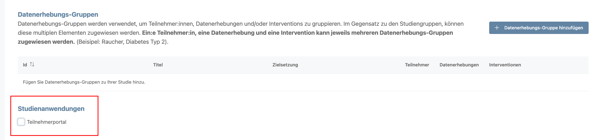
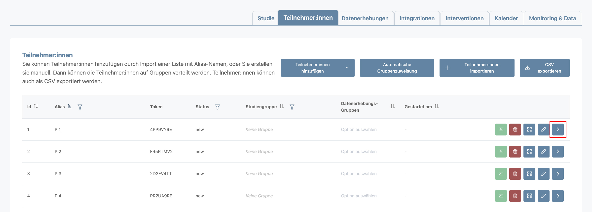
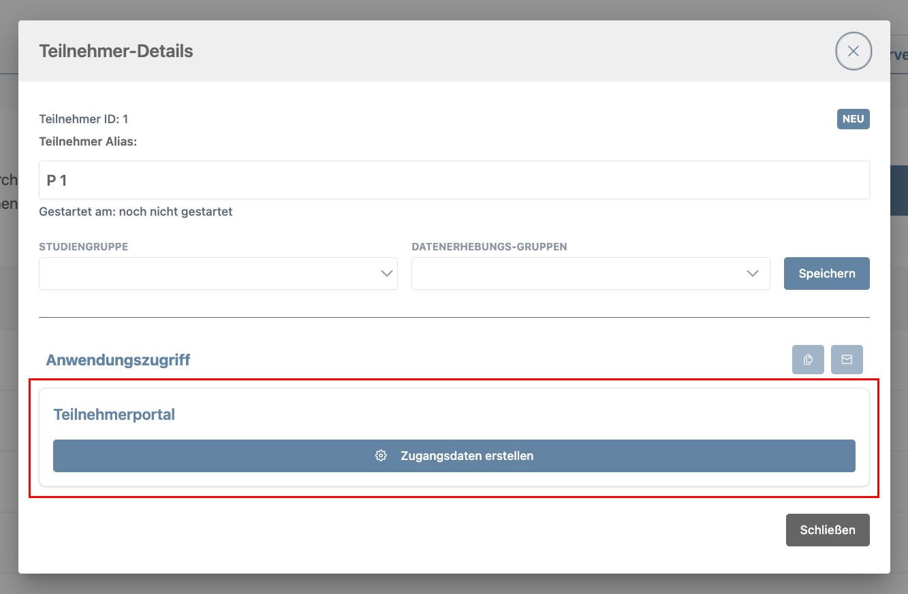
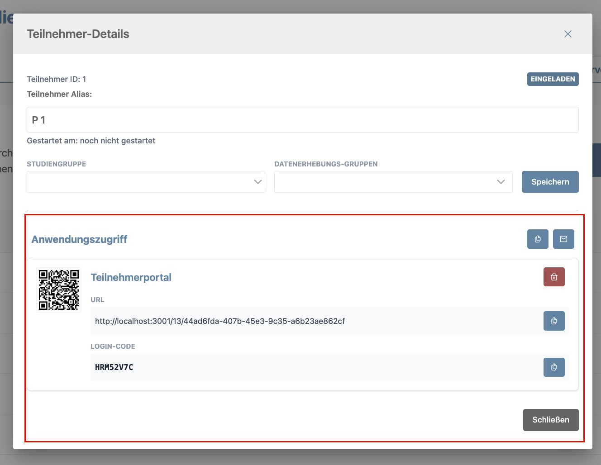
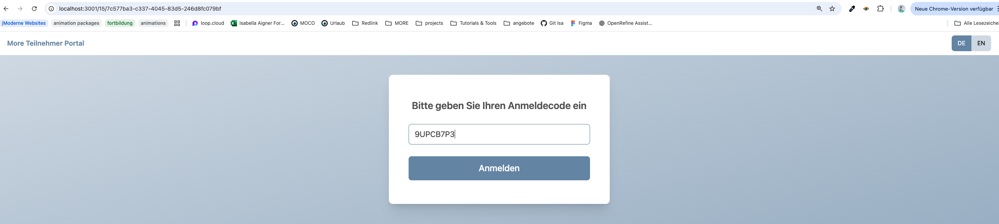
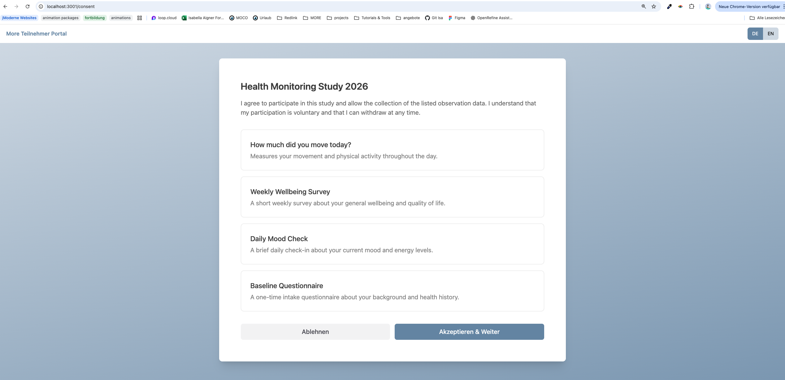
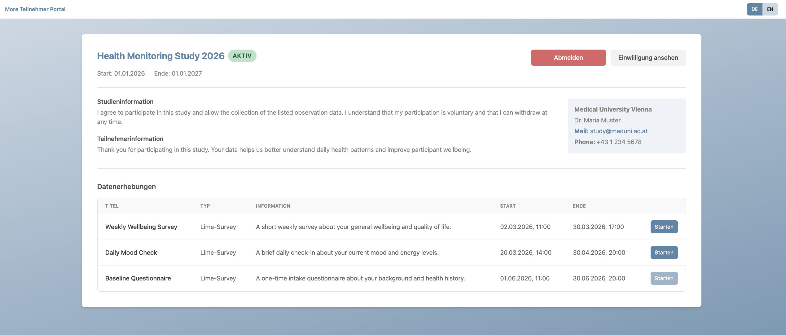

# <span style="color: #6E8FAC">StudyManager: LimeSurvey-Only Study</span>

## <span style="color: #6E8FAC">Description of the Use Case</span>

In MORE, there is a special type of study that uses only LimeSurvey questionnaires. In this case, the mobile app is not required, because participants only need access to the LimeSurvey questionnaires assigned to them.

---

## <span style="color: #6E8FAC">Approach and Workflow Description</span>

To enable participation without using the mobile app, the app is replaced by a web application (Participant Portal). The Participant Portal provides a simple login process including consent handling and access to the assigned LimeSurvey questionnaires.

The web application is accessed via a link generated by the StudyManager. Using this link, participants can log in to the Participant Portal and complete the available LimeSurvey questionnaires.

Similar to the mobile app, the web application requests a redirect link for each LimeSurvey questionnaire and forwards the participant to the corresponding LimeSurvey web interface. This redirect link is only active when the associated LimeSurvey observation schedule is currently active. Participants can then complete the questionnaire there.

---

## <span style="color: #6E8FAC">Implementation</span>

### <span style="color: #6E8FAC">LimeSurvey Configuration</span>

The LimeSurvey configuration documentation is available under the [more-limesurvey repository](https://github.com/MORE-Platform/more-limesurvey). There are specific settings that are needed that lime survey works with MORE.

---

### <span style="color: #6E8FAC">StudyManager Extension</span>

#### <span style="color: #6E8FAC">Study Configuration Extension</span>

To enable the use of the Participant Portal, the study configuration introduces a boolean-like configuration mechanism that allows activating access to the portal for a study.

```yaml
# StudyManagerAPI.yaml - Study Schema extension
applicationAccess:
  type: array
  description: Application types which the user has access to
  items:
    type: string
```

The `applicationAccess` field defines which applications participants can use besides the MORE App. Currently, only "participantPortal" is supported.

##### <span style="color: #6E8FAC">StudyManager Configuration (UI)</span>

You'll find the setting on the Study Details page for a specific study.



#### <span style="color: #6E8FAC">Participant Access to the Participant Portal</span>

When the Participant Portal is activated, the feature can be used for the study.

##### <span style="color: #6E8FAC">Technical Extension</span>

1.  **Participant Portal URL generation:** The backend generates a portal URL containing the study ID and a participant reference. A UUID-based mapping table in the backend links the Participant Portal user ID to internal entities (e.g., `participantId`, `observationId`, `scheduleId`) to prevent exposure of participant data.
2.  **Participant Portal Login Code:** A reusable login code is generated together with the URL (similar to the mobile app login token) and validated by the Gateway during authentication on the Participant Portal..

Study researchers (roles: Admin, Operator) can generate these credentials per participant from the participant list.

##### <span style="color: #6E8FAC">Participant List Extension (UI)</span>

The participant list provides a new action button for the participant itself. This action button opens a dialog where the study researcher (Role: Admin or Operator) can access the generation process via a button. The generated URL remains stable and reusable even if observation settings change.

<figure>
  
  <figcaption>Step 1: New Action Button to open the Dialog.</figcaption>
</figure>

| | |
|:--:|:--:|
|  |  |
| *Step 2: Open Participant Dialog with Participant Portal section.* | *Step 2: Generated URL and code for the participant portal login.* |

---

### <span style="color: #6E8FAC">Participant Portal</span>

The Participant Portal is a web application that provides participants access to their assigned LimeSurvey questionnaires ([Participant Portal repository](https://github.com/MORE-Platform/more-participant-portal/pull/4)).

#### <span style="color: #6E8FAC">Description</span>

Participants access the portal using the generated URL and login code. After login and consent confirmation, they can view study information and a list of scheduled LimeSurvey questionnaires. Only currently active surveys are accessible via redirect links.

#### <span style="color: #6E8FAC">Tech Stack Used</span>

| Tool | Purpose |
| :--- | :--- |
| **Vue 3** | UI framework |
| **Vite** | Build tool |
| **TypeScript** | Type safety |
| **Vue Router** | Client-side routing |
| **Pinia** | Client-side state (e.g., auth; survey caching optional) |
| **TanStack Query** | Server state / data fetching |
| **TailwindCSS** | Primary styling via utility classes |
| **PrimeVue** | Styled mode (Aura theme, design token overrides planned) |
| **OpenAPI Generator** | Generates typed API clients (`npm run generate:api`) |

#### <span style="color: #6E8FAC">Participant Portal (UI)</span>

**Participant Portal Login:** Participants receive a Participant Portal URL and login code from the study contact (Role: Admin or Operator). After entering, the login code is verified by the Gateway before access is granted.



**Consent Confirmation:** If the participant has not yet accepted the consent, the participant is redirected to the consent confirmation screen. The displayed consent elements depend on the study configuration and active observations (same workflow as in the mobile app). The participant can either accept or decline all the consent together. Participation in the study is only possible if the consent is accepted.



**Participant Study Flow:**
- After login, the Gateway provides information about the study and observations. The portal currently only supports LimeSurvey observations and is designed to allow future extensions.
- The shown observation list displays available surveys and provides redirect links to the LimeSurvey web interface for active questionnaires.


