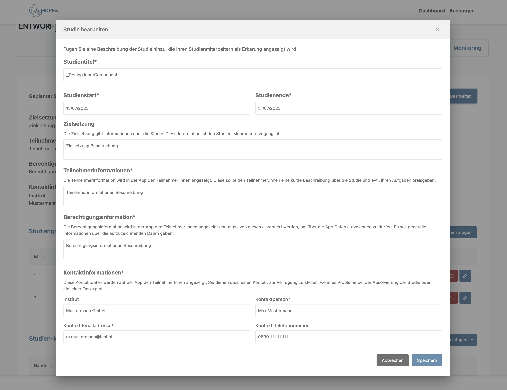
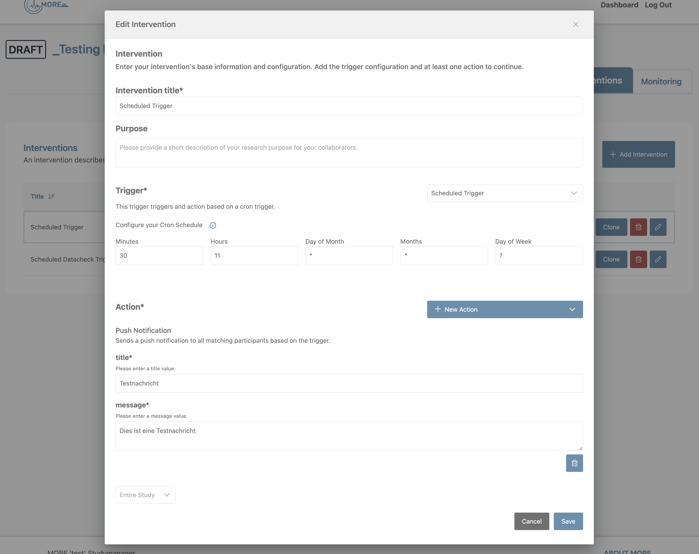

# 1. Introduction

The StudyManager Web Application offers an user interface to researchers and their collaboraters to set up, regulate and control a study from its start to end. It provides and controls all configurations to the data, that should be collected from participants. The More App actively collects data from participants based on the configurations made on the StudyManger Web App.

## 2. Local Setup

To be able to run the web app locally, there are only a view simple steps needed, **after setting up the Authentication and Backend server** (see [ARC42: 7. Deployment View](https://github.com/MORE-Platform/.github-private/blob/main/docs/07_deplyoment_view.md)).

#### General Information
The More Frontend Application was developed with [Vite 3](https://devdocs.io/vite~3/) and [Vue 3](https://vuejs.org/guide/introduction.html) ([Composition API](https://vuejs.org/guide/extras/composition-api-faq.html)). It uses [TailwindCSS](https://tailwindui.com/) as styling library, [Primevue](https://primevue.org/) as component library, [PostCSS](https://postcss.org/) as Preprocessor, [TypeScript](https://www.typescriptlang.org/) and the [Pinia Store](https://pinia.vuejs.org/). It is optimiced for [Multilinguality (i18n)](https://kazupon.github.io/vue-i18n/) and it's API calls are generated via the [Open Api Generator](https://openapi-generator.tech/) based on the ```StudyManagerApi.yaml```.

### 2.1 Clone instance
Clone your instance of more-studymanager-frontend

### 2.2 Install and run instance
- Install npm packages: ```npm install```
- Generate api: ```npm run generate:api```
- Run dev instance: ```npm run dev```
- Run linter to fix code formatting issues: ```npm run lint:fix```

### 2.3 Check build process
- Build instance: ```npm run package```
- Build instance quickly: ```npm run package:quick```

### 2.4 Change backend target
The target variable for the backend target is defined inside ```vite.config.ts```. Set the variable inside an ```.env``` file to change target to local or change the target itself. It is recommended to use the first option.

### 2.6 Check licenses
It is possible to check licenses based on used packages and list them.
- Check licenses: ``npm run license:check``
- Get full license list: ```npm run license:list```

## 3 Deployment
To build the frontend deployment the ```Dockerfile``` defines the step to step configuration for how to run the deployment pipeline. The ```watchtower```, which is part of the [more-deployment-docker](https://github.com/MORE-Platform/more-deployment-docker), recognizes new versions inside the **docker-registry** and updates the deployment automatically.

For more information see [ARC42: 7.1 More Platform](https://github.com/MORE-Platform/.github-private/blob/main/docs/07_deplyoment_view.md).

## 4. Main Component Usage
The Vue application is build upon reusable [**Single File Components** (SFC)](https://vuejs.org/guide/scaling-up/sfc.html), that enable encapsulation of templates, logic and styling of a Vue component through templates. An SFC contains CSS (PostCSS), JS (TS) and HTML used for the specific template and allows template-based loading and rendering of features and components based on their usage.

The Components were developed based on their functionalities and are imported into their corresponding views or other components. Properties and emits are enabling their reactivity.

### 4.1 MoreTable & List Components
One of the main components is the ```MoreTable.vue``` (```./src/components/shared/MoreTable.vue```), which is pretty much used for every listing of information or data. The table is based on the [Primevue Datatable](https://primevue.org/datatable/) and uses actions, columns and a list of corresponding objects. It provides ```row actions```, as well as ```table actions```, which are defined one level above inside it's ```List components```.

#### Example StudyGroupList

***Table & Row Actions***
```
  const tableActions: MoreTableAction[] = [
    {
      id: 'create',
      label: t('studyGroup.dialog.header.create'),
      icon: 'pi pi-plus',
      visible: () => getEditAccess(),
    },
  ];

    const rowActions: MoreTableAction[] = [
    {
      id: 'delete',
      label: t('global.labels.delete'),
      icon: 'pi pi-trash',
      tooltip: t('tooltips.moreTable.deleteStudyGroupBtn'),
      visible: () => getEditAccess(),
      confirmDeleteDialog: {...}
      },
    },
  ];
```

***Columns definition***

The columns array define which properties will be shown in the table and which functionalities will lie on each column. It is possible to define if the column should be ```editable```(activates inline edit for that cell), ```filterable```(activates filter option for the cell group) and/or ```sortable```(activates sorting for the cell group).
```
  const studyGroupColumns: MoreTableColumn[] = [
    {
      field: 'studyGroupId',
      header: t('global.labels.id'),
      sortable: true
    },
    {
      field: 'title',
      placeholder: t('studyGroup.groupList.placeholder.title'),
      header: t('study.props.title'),
      editable: true,
      columnWidth: '18vw',
    },
    ...
  ]
```

***Table***


### 4.2 Dialog
Another batch of important reusable components are the **Dialogs**, which are based on the [Primevue Dynamic Dialog](https://primevue.org/dynamicdialog/) or the [Primevue Confirmation Dialog](https://primevue.org/confirmdialog/). Their main function is to create/edit an entity or provide further information to actions taken, that are required to be confirmed by the researcher (```./src/components.dialogs```).

Note: A dialog takes in the data that has to be displayed or edited (```data: {...}```) and uses the ```toClose()``` event to save/delete/close the item referred to.

#### Example

***StudyDialog (create) example***
```
dialog.open(StudyDialog, {
      data: {
        study: undefined,
      },
      props: {
        header: t('study.dialog.header.create'),
        style: {...},
        breakpoints: {...},
        modal: true,
        draggable: false,
      },
      onClose: (options) => {
        if (options?.data) {
          studyStore.createStudy(options.data as Study);
        }
      },
```

***Create Study Dialog***


***Delete StudyGroup Dialog***


### 4.3 InputProperty Components
More complex dialogs like the **Observation Dialog** or **Intervention Dialog**, which need to be easily extendable, contain their own **InputProperty Components**. Those components are called and rendered based on the modules property types. The type of each property is predefined in the Backend through the Component Factory, which differenciates between **Observation**, **Trigger** and **Action** (```./src/components/dialog/shared```).

Defined types are processed in the frontend through the ```InputModels.ts``` (```./src/models/```). It defines how each property is parsed (```fromJson()```, ```toJson()```) and validated (```validate()```). Each new added type has to be defined through here and added as its own component into the directory ```.src/components/shared```, as well as imported to the ```InputProperty.vue``` component. The ```InputProperty.vue``` component is reused through Intervention and Observation Dialogs.

### 4.4 Extension Blueprint Frontend

To be able to parse and handle a new type in the frontend that can be handled via modularisation, its type, functionalities and component input property template has to be prepared beforehand. This will tell the Frontend Application how to handle the specific type added in the backend and will allow an automatic rendering of the instance by the property types of an component inside its component factory.

#### 4.4.1 Extension Blueprint for the Backend

See [Extension Blueprint](https://github.com/MORE-Platform/more-extension-blueprint) for further information on adding types and extensions in the backend.

#### 4.4.2 InputModel definition
The InputModels for each type is based off of the ``abstract class Property<T>``, which defines an abstract blueprint on how to parse and validate a property in general. The definitions can be found in ```./src/models/InputModels.ts```.

##### 4.4.2.1 Constructor
The constructor is composed of general information of a property (id, description, name, required, immutable), as well as its ```defaultValue``` and actual ```value```. Does the property exist on the component object itself but has not yet been defined, the defaultValue will be used as blueprint.

#### 4.4.2.2 fromJson(value)
The ```static fromJson(value: any): Property<any> {...}``` function defines how each property will be parsed into the Property Object. This is used to handel the Property Instances on template level.

The abstract function maps the backend types to their corresponding frontend classes, which defines the specific parsing prosesses for each property (e.g. ```CRON``` to ```CronProperty.fromJson()```).

```
static fromJson(value: any): Property<any> {
  switch (value.type) {
    case 'STRING':
      return StringProperty.fromJson(value);
    case 'CRON':
      return CronProperty.fromJson(value);
    ...
    default:
      throw new Error('cannot case property');
  }
}
```

##### 4.4.2.3 toJson(props)
The ```static toJson(props: Property<any>[]): any{...}``` function parses the property back to its original json form. This json property is sent to the backend with the whole (observation or intervention) object, to be saved into the backend.

##### 4.4.2.4 setValue(v)
While using the ```property.fromJson()``` function, the ```public setValue(v: T): Property<T>``` function checks if an already existing value is present and sets it into the ```value``` property. If not the ```defaultValue``` will be set here.

See [4.4.3 Parsing and mapping a property](#4.4.3-parsing-and-mapping-a-property) for specifics.

#### 4.4.2.5 Validate()
The ```validate(): string | undefined {...}``` function defines how each property should be validated, to make sure a valid json property is sent to the backend in the end. It's complexity depends on the complexity of the InputProperty Type.

***Example validated StringProperty based on regex***
```
  validate(): string | undefined {
    if (this.required && this.value === undefined) {
      return 'Value is required';
    } else if (
      this.regex &&
      this.value &&
      !new RegExp(this.regex).test(this.value)
    ) {
      return 'Value has wrong value';
    } else {
      return undefined;
    }
  }
```

#### 4.4.3 Parsing and mapping a property
To parse a ```Property<T>``` both the specific ```Component Factory``` for an observation, trigger or action and the ```values``` of already existing components (if present) have to be mapped on another. Each Component can have more than one property. The property type is defined inside the ```Component Factory``` which is mapped by id on each property.

***TriggerFactory Cron Property (triggerTypeProps)***


***Parsing a property***
```
const properties: Ref<Property<any>[]> = ref(
  triggerTypeProps.map((json: any) => Property.fromJson(json))
);
```


***Parsing a property with value***
```
const properties: Ref<Property<any>[]> = ref(
    factory.properties
      .map((json: any) => Property.fromJson(json))
      .map((p: Property<any>) => p.setValue(observation.properties?.[p.id]))
  );
```

#### 4.4.4 Vue Template
The parsed Input Property is processed by a specific Input Property Template, that defines how the Property UI should look like. Input Property Templates are saved inside the ```./src/components/dialog/shared``` directory. The ```PropertyInputs.vue``` component collects every existing input property component and runs from the parent given Property Array through them, to render Input Components based on the Property instance types.

##### 4.4.4.1 Emits
The ```PropertyInput.vue``` component uses two ``emits`` to process the change of data.

``onPropertyChange`` sends the new Property value together with the Property index inside the Array to its parent. Inside the parent the property value is updated and validated before being saved to the backend.

``onError``sends the error message to the parent. Based on existing errors the parent will save or not save the form. The location of the displayed error message will be defined by the template itself though.

The specific input property components can work with more emit handles, but only the two defined emits can be sent to the parent of the ```InputProperty.vue``` itself.

***Example Cron Scheduler Configuration***
```
<CronSchedulerConfiguration
  v-if="property instanceof CronProperty"
  class="mb-4"
  :editable="editable"
  :cron-schedule="property.value"
   @on-valid-schedule="
     emit('onPropertyChange', { value: $event, index: index })
   "
   @on-error="
     emit('onError', { value: $event ? $event : '', index: index })
    "
/>
```

***Example StringProperty***
```
<StringPropertyInput
  v-if="property instanceof StringProperty"
  :property="property"
  class="mb-4"
  :editable="editable"
  @on-input-change="
    emit('onPropertyChange', { value: $event.value, index: index })
  "
/>
```

#### 4.4.4.2 StringProperty Input Template Example
The ```StringProperty``` describes and easy InputText field, which displays title, description and the input text field for the property and will send the new value to the ``InputProperty.vue`` through an emit template when changed. The ```InputProperty.vue``` component itself will send the changed value to its parent to update the properties itself.

***Input Property taken by the child input component***
```
  const props = defineProps({
    property: {
      type: Object as PropType<StringProperty>,
      required: true,
    },
    editable: {
      type: Boolean,
      default: true,
    },
  });
 ```
The ```editable``` property tells the input component, if the form section is editable (draft and paused status of a study) or in view modus.

***Template StringPropertyInput.vue***
```
<template>
  <div class="flex flex-col gap-1">
    <h6 class="font-bold">
      <label v-if="property.name" :for="property.id"
        >{{ $t(property.name) }}<span v-if="property.required">*</span></label
      >
    </h6>
    <small v-if="props.property.description" :id="property.id + '-help'">{{
      $t(props.property.description)
    }}</small>

    <InputText
      :id="property.id"
      v-model="property.value"
      type="text"
      class="w-full"
      :aria-describedby="property.id + '-help'"
      :disabled="!editable"
      :placeholder="
        props.property.description
          ? $t(props.property.description)
          : 'Enter text value'
      "
    />
  </div>
</template>
```

***Watches the input property and emits changes to the PropertyInput.vue***
```
  watch(props.property, () => {
    emit('onInputChange', props.property);
  });
```

***Rendered StringPropertyInput***


#### 4.4.5 Processing Properties by the parent
After the property values were updated on the parent component (example ```ObservationDialog.vue```) and when the user is trying to save the new component object to the backend, the properties will run through their 'backend' validation process. The properties array is parsed through the ```Property.toJson()``` function and the whole component information is run through the in the backend defined validation process of a component (see ComponentsApi: ```componentsApi.validationProperties(componentType, componentId, parsedProperties)```)). The component object is sent to the backend and saved and the form dialog is closed, if the validation process runs through without any error.

```
  function validate() {
    let parsedProps: any;
    try {
      parsedProps = Property.toJson(properties.value);
      componentsApi
        .validateProperties(
          'observation',
          observation.type as string,
          parsedProps
        )
        .then((response: any) => response.data)
        .then((report: ValidationReport) => {
          if (report.valid) {
            save(parsedProps);
          } else {
            jsonError.value = (report.errors || [])
              .concat(report.warnings || [])
              .map((e) => e.message)
              .join(', ');
          }
        });
    } catch (e: any) {
      jsonError.value =
        t('observation.error.noValidField') + " '" + e.key + "': " + e.message;
    }
  }
```

### 4.5 Configure cron scheduler on the intervention
The cron scheduler, used to schedule the interval of an intervention is a rather powerful and complex tooling and can seem overwhelming at first glance. Due to its complex nature there are many open source and free tools that can help to get a quick start on setting up the cron scheduler properties themselves. Not that the Cron Schedule used by the More interventions will set seconds and years automatically by default to full second (0) and any year (?).

See a complete guide to the Cron scheduler at the [Cron Schedule Documantation](https://www.quartz-scheduler.org/documentation/quartz-2.3.0/tutorials/crontrigger.html) Website or get a quick start with the [Cron Expression Generator Quartz](https://www.freeformatter.com/cron-expression-generator-quartz.html) to help you set up your intervention interval.

### 4.6 Multilinguality i18n
The language used on the StudyManager Frontend Web App is automatically set based on the used browser language. Each language can be defined via its own ```language.json``` file inside the ```./src/i18n```. For the time being only english and german is available, setting english as default.

## 5. Studymanager Components Overview
Though the configuration on the StudyManager Web App define what data is collected how on the app, only the important information for the participant is shown on the app.

Generally speaking all participant and consent information will be listed in one way or another on the app for the participants to see. They are important information for the usage of the different modules and the use of the collected data.

### 5.1 Study Dashboard
On the dashboard all studies, which the researcher created himself or was invited to, are listed. The list shows general information to the studies and provides an option to export study data and study configurations or import study configurations to the list.


### 5.2 Overview

**General Information:**
The overview shows the general information for the study. Additional to the consent and participant information the contact information is shown on the app. It provides the participants with information how to get in contact for help. This data can be easily edited through the edit button.


**Study Groups** will not be shown on the app but can be used to organize other modules like observations and intervention, as well as the participants into groups, to get different sets of data (e.g. A/B-Testing).


**Study Collaborators** show the people helping with managing the study and can be added through the table. The collaborator added to the study has to be registered in the system first. There are three different roles: ***Study Administrator*** and ***Study Operator*** are allowed to see and edit everything, ***Study Viewer*** is only allowed to see the *Overview* and *Monitoring* sections.


### 5.3 Participants
The participant list shows all participants of the study. Particpants can be added via automatically generating or importing participants. The participant itself is unique for the study and can't be linked to other studies to guarantee privacy protection regulations. The **Tokens** are automatically generated when participants are added to the list and are used to log a participant in the app.

Export and import participants are using csv files, but the import takes only a simple list of aliases to base a new set of participants on it.


### 5.4 Observations
Observations are modules used to collect data via the app. They can be defined and scheduled based on their types. The consent information for each created observation will be listed on the app. They have to be accepted by the participants before entering the study.

An observation can either be **hidden** or **not hidden**. **Hidden observations** will not be listed on the participants schedule inside the app and will be started in the background automatically as long as the participant is logged in. They can be found after start or finish inside the *Running observations* or *Completed observations*. **Not hidden observations** are listed on the daily schedule for the participant. These are mostly observation modules where the participant has to do something actively.


### 5.5 Integrations
Integrations provide an API based interface to connect an external device or service to the More Platform. An integration will be linked to one specific observation and timed with its schedule. It generates a token which can be used to add the external service. An integration can be recreated anytime, since it solely links the external service to the system to write datapoints into the backend on the linked observation.


### 5.6 Interventions
Interventions provide a system to react on some trigger factors and take a specific action, when the trigger conditions are met. It is differenciated between a timebased trigger (Scheduled Trigger) or a Conditional Trigger based on observation modul data (Scheduled Datacheck Trigger). All trigger can have multiple actions to define what should happen after the intervention was set off.

***Intervention List***


***Scheduled Trigger***


***Scheduled Datacheck Trigger***


### 5.7 Monitoring
The Monitoring section shows general information on when the last datapoint was collected per participant, grouped by observation modules.


## 6. Component Diagram

### 6.1 Diagram from 14.07.2023


- <a href="./img/Componentdiagram_2023-07-14.png" target="_blank">Open image in new tab</a>
- <a href="./img/Componentdiagram_2023-07-14.png" title="Download" download>Download image</a>


