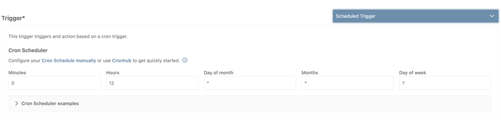
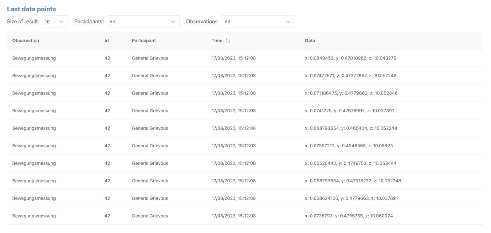

The **Study Manager Frontend** is the web application to manage studies.
The Apps (iOS and Android, latest versions v.2.3.8) are the interfaces
for participants of a study.

This document provides a short overview on the study manager frontend
and the features to create and configure a study.

The Study Manager Fronted

[Dashboard [3](#dashboard)](#dashboard)

[Create study
[3](#create-a-new-study-or-import-a-study-configuration)](#create-a-new-study-or-import-a-study-configuration)

[Import study configuration
[4](#import-study-configuration)](#import-study-configuration)

[Study row actions
[4](#study-row-actions-on-the-dashboard)](#study-row-actions-on-the-dashboard)

[Copy link to study page
[4](#get-a-link-to-the-study-page)](#get-a-link-to-the-study-page)

[Delete Study [4](#delete-a-study)](#delete-a-study)

[Export study configurations
[4](#export-study-configurations)](#export-study-configurations)

[Export study data [4](#export-study-data)](#export-study-data)

[Edit study row information
[4](#edit-study-row-information)](#edit-study-row-information)

[Go to study subpage
[5](#navigate-to-study-overview-page)](#navigate-to-study-overview-page)

[Study Tab Navigation [6](#study-navigation)](#study-navigation)

[Study [7](#study-details)](#study-details)

[Study Details Information [7](#study-details)](#study-details)

[Study States [7](#study-states)](#study-states)

[Study Groups [7](#study-groups)](#study-groups)

[Study Collaborators [8](#study-collaborators)](#study-collaborators)

[Study Collaborator Roles
[8](#study-collaborator-roles)](#study-collaborator-roles)

[Participants [9](#participants)](#participants)

[Create Participants [9](#create-participants)](#create-participants)

[Import participants via CSV
[10](#import-participants-via-csv)](#import-participants-via-csv)

[Assign Study Groups [10](#assign-study-groups)](#assign-study-groups)

[Assign study groups manually
[10](#assign-study-groups-manually)](#assign-study-groups-manually)

[Assign study groups automatically
[11](#assign-study-groups-automatically)](#assign-study-groups-automatically)

[Export Participants [12](#export-participants)](#export-participants)

[Participant Token [12](#participant-token)](#participant-token)

[Observations [13](#observations)](#observations)

[Hidden and Not hidden observations
[13](#hidden-and-not-hidden-observations)](#hidden-and-not-hidden-observations)

[Types of observations
[13](#types-of-observations)](#types-of-observations)

[Accelerometer Mobile Sensor
[14](#accelerometer-mobile-sensor)](#accelerometer-mobile-sensor)

[Simple Question Observation
[14](#simple-question-observation)](#simple-question-observation)

[GPS Mobile Sensor [15](#gps-mobile-sensor)](#gps-mobile-sensor)

[External Observation
[15](#external-observation)](#external-observation)

[Polar Verity Sensor [15](#polar-verity-sensor)](#polar-verity-sensor)

[Lime Survey Observation
[16](#lime-survey-observation)](#lime-survey-observation)

[Schedule an observation
[16](#schedule-an-observation)](#schedule-an-observation)

[Individual Observation
[17](#individual-observation)](#individual-observation)

[Ongoing observation [19](#ongoing-observation)](#ongoing-observation)

[Integrations [21](#integrations)](#integrations)

[Create an integration
[21](#create-an-integration)](#create-an-integration)

[Connect to API [22](#connect-to-api)](#connect-to-api)

[Interventions [23](#interventions)](#interventions)

[Scheduled Trigger [23](#scheduled-trigger)](#scheduled-trigger)

[Scheduled Datacheck [23](#scheduled-datacheck)](#scheduled-datacheck)

[Configure Trigger Conditions
[24](#configure-trigger-conditions)](#configure-trigger-conditions)

[Trigger values and properties
[25](#trigger-values-and-properties)](#trigger-values-and-properties)

[Example for the “only once flag”
[26](#example-for-the-only-once-flag)](#example-for-the-only-once-flag)

[Action [26](#action)](#action)

[Monitoring [27](#monitoring)](#monitoring)

[Last data points [27](#last-data-points)](#last-data-points)

[Received data points per observation
[28](#received-data-points-per-observation)](#received-data-points-per-observation)

[Table of Figures [29](#table-of-figures)](#table-of-figures)

#  Dashboard

The study manager dashboard shows all studies that the researcher has
created or was invited to.

## Create a new study or import a study configuration

The button **Add new study** *\[Figure 1: 1a\]* let you create a new
study, which will be added to the list afterwards.

Figure 1: Study list
\[1a: Add new study, 1b: Import study\]

The **Create study dialog** *\[Figure 2\]* gives a clear outline of
information needed to successfully add the study details information.
This includes study title, duration, purpose, participant information
(shown on the app), consent information (shown on the app), study
contact information (shown on the app) and information displayed at
study end to the participants.

Figure 2: Study dialog

## Import study configuration

It is possible to import study configurations from already existing
studies. If you want to import some study configurations, you can export
the Study configuration *\[Figure 3: 2c\]* first from the individual
study row and import it via the **Import study** *\[Figure 1: 1b\]*
button as a new preconfigured study. Now you can edit the study in every
detail and make it work as new study.

*Note that study participants, integrations and monitoring are not
included from the old study configuration and you need to recreate the
link between study groups and observations for the new study.*

## Study row actions on the dashboard

Every row of the study list has action buttons which can be used per
study entity *\[Figure 3\]*.

### Get a link to the study page

To point to a specific study, you can **copy the link to the study**.
*\[Figure 3: 2a\].  
Note that only previously invited researchers can view data and
information on study level (see Study Collaborator Roles).*

### Delete a study

It is possible to delete a study from the list *\[Figure 3: 2b\]*. Only
studies with the **draft** or **completed** status can be deleted from
the study list *(see Overview: Study states)*.

### Export study configurations

**Exporting study configurations** *\[Figure 3: 2c\]* provides a JSON of
the study configuration that **can be imported again as basis for a new
study** *\[Figure 1: 1b\]*.

### Export study data

**Exporting study data** *\[Figure 3: 2d\]* makes it possible to analyze
the study data in detail on participant or group level and with all
observation and action data points. It is a JSON file which incldes all
the data in detail up to the time of exporting.

### Edit study row information

The **pencil button** enables an **in row edit functionality** *\[Figure
3: 2e\]* for the information that is shown on row level. Here you can
quickly edit study title, purpose and the planned start and end date of
the study.

### Navigate to study overview page

The **last button** on row **leads directly to the specific study page**
*\[Figure 3: 2f\]* (Overview). Alternatively, you click on the row
itself.

Figure 3: Dashboard row
features \[2a: copy link to study page, 2b: delete study, 2c: export
study config, 2d: export study data, 2e: edit study row information, 2f:
go to study subpage\]

#  Study Navigation

After opening a study you get to a tab navigation to configure and view
all parts of the study configuration.

Figure 4: Study
Tab-Navigation

The **Study Tab** *\[Figure 4: 1a\]* shows the basic detailed
information of the study and let change the study states *(see Study
States)*. Underneath you can use the **Study Group Feature** to add and
manage study groups / study arms and add **Collaborators** *(see
Study)*.

The **Participants Tab** *\[Figure 4: 1b\]* provides a list of
participants. For every participant it shows id, alias, participant
token (needed to log into the App) and status in the study.
*\[see
Participants\]*.

The **Observation Tab** *\[Figure 4: 1c\]* provides a list of configured
observations. Different types of observations (data capture modules) can
be created and scheduled here *\[see Observations\]*.

The **Integration Tab** *\[Figure 4: 1d\]* provides a list of
integrations to link external data or services to an already existing
observation and its schedule. It creates the API token needed to push
external data to a More study *\[see Integrations\]*.

The **Interventions Tab** *\[Figure 4: 1e\]* provides a list of
interventions, that can be created and configured to define intervention
conditions for JITAI[^1] actions *\[see* Interventions*\]*.

The **Monitoring Tab** *\[Figure 4: 1f\]* provides basic information for
running observations and collected participant data *\[see \]*.

#  Study Details

The Study section consists of three different sections: study details
information, study groups and study collaborators.

The study information provides edit functionality to change or adapt the
basic information of a study *\[Figure 5: 1a\]* and a button to change
the study states *\[Figure 5: 1b\]*.

Figure 5: Study details

## Study States

The **Draft State** is the first state of a study when it is configured
after being created.

The **Active State** is set when the study is (re)started. If the study
is in its **active** state, participants can log into the app and
participate in the study.

The **Paused State** pauses the study until it is restarted or set to
completed. Participants on the app can’t collect data during the study
pause. The updated study configuration will be transferred to the Apps,
when the study is continued and set back to active.

The **Completed State** sets the state to completed. A completed study
can’t be re activated. Participants on the app will not be able to
collect any data anymore and the study has officially ended.

The study can be edited in **draft** and **paused status** only, and the
study can only be deleted in **draft** or **completed status**.

## Study Groups

**Study groups** are used to collect participants, observations, and
interventions to monitoring groups, like study arms. Study groups can be
added, edited via inline edit or deleted. Is a study group deleted all
its links and groups are deleted with it and participants, observations
and interventions linked to the group will be handled without a group
and **apply now for the whole study**.

Figure 6: Study group
list

## Study Collaborators

**Study collaborators** are researchers that you can invite to your
study to help you with monitoring and/or managing study details and
data. Note that only researchers that are already registered to the MORE
can be found and added to the collaborator list.

Figure 7: Study
collaborator list

### Study Collaborator Roles

Study collaborator roles set permissions invited researcher can have.
The provided roles are **Study Administrator**, **Study Operator** and
**Study Viewer**.

- **Study Administrator** is allowed to manage, change, and view any
  information and data.

- **Study Operator** is allowed to manage and view information but is
  not allowed to view recorded data.

- **Study Viewer** is only allowed to view recorded data and the basic
  study information.

#  Participants

The **Participants tab** includes the **participants list** *\[Figure
8\]* with all participants contributing to your study. You can create as
many participants needed, distribute them to your before created study
groups and export the list locally. A participant will only be active
after having logged in into the app.

Figure 8: Participants
list

## Create participants

Participants can either be **added manually** or by **importing aliases
and study groups** from an CSV file.

#### Add participants manually

Using the button **Add participants** up to 50 participants can be added
manually to the participant list *\[Figure 9: 1a\]*

Figure 9: Add
participants manually \[1a: add participants\]

### Import participants via CSV

The Button **Import CSV** a list of participants can be added to your
participant list at once *\[Figure 10: 1b\]*. To **import participants
from a CSV file**, only the **alias names** should be listed per line
*\[Figure 11\]*. Each line will be transferred to one participant inside
the list.

Figure 10: Import
Participants \[1b\]

Figure 11: Content of
import CSV

## Assign Study Groups

Study groups can be set either manually for each row through the edit
mode or automatically via the **Assign study groups** *\[2d\]* button.

### Assign study groups manually

1.  Enter the edit mode of the specific participant row *\[Figure 12:
    2a\]*

2.  Choose the study group you want to assign over the study groups
    dropdown *\[Figure 13: 2b\]*

3.  Save the participant row via check *\[Figure 13: 2c\]*

Figure 12: Edit
participant manually \[2a: Edit button\]

Figure 13: Change study
group for participant \[2b: Study group dropdown, 2c: Save Participant\]

### Assign study groups automatically

Through the button **Assign study groups** *\[Figure 14: 2d\]* the
automatic distribution of participants to study groups can be handled.
Participants will be assigned evenly to all study groups automatically.
Note that if you use this option **all participants will always be
(re)assigned to the study groups evenly, even if they already were
assigned to groups before**.

Figure 14: Assign study
groups \[2d\]

## Export Participants

The **Export Participants** *\[Figure 15: 3a\]* button **exports an
already existing participant list to a CSV file** *\[Figure 16: 3b\]*
with StudyId, Study Title, Participant Alias, Participant Id and
Registration token (if the participant hasn’t logged in yet).

Figure 15: Export
Participants \[3a\]

Figure 16: Exported
participants CSV

## Participant Token

The **participant token** *\[Figure 17: 4a\]* is created with each new
participant. It **is used to log in the participant into the app**. The
participant token will be deleted from the list if the participant is
logged into the app successfully.

Figure 17: Participant
token

#  Observations

Observations are the heart of the More Application, since they **are
used to collect and monitor participants activities and data**.
Different observation modules do have different capacity of what kind of
data they are collecting.

## Hidden and Not hidden observations

Generally, an **observation can either be hidden or not hidden**
*\[Figure 18: 1a\]*. **Hidden observations** will not be listed on the
participants schedule inside the app and **will be started in the
background automatically** if the participant is logged in. **Not hidden
observations** are **listed on the daily schedule for the participant**.
These are mostly observation modules where the participant must do
something actively.

Figure 18: Observation
dialog \[1a: Hidden/not hidden flag\]

## Types of observations

The More platform already has some **observation types integrated**
*\[Figure 19\]*, which provide specific functionalities.

Figure 19: Observation
types

### Accelerometer Mobile Sensor

This observation uses and **tracks accelerometer data via the
Accelerometer Mobile Sensor**. It collects data based on its properties
x, y and z, which can also be used to set intervention conditions when
added to a Scheduled Datacheck *(see Interventions)*.

### Simple Question Observation

The **Simple Question Observation** is a Simple Question option, that
can help to inquire simple states from the participants, like how they
are feeling right now. It **provides the option to define one question
with five answers** *\[Figure 20\]*, that can simply be answered by the
participant on the app.

Figure 20: Create Simple
Question Observation

### GPS Mobile Sensor

This observation uses and tracks **gps data via the GPS Mobile Sensor.**
It collects data based on its properties altitude, latitude and
longitude, which can also be used to set intervention conditions when
added to a Scheduled Datacheck *(see Interventions)*.

### External Observation

An external observation is basically an **“empty observation” to link
Integrations to**. It provides the **basis to add external data via the
Integration API to the More system**. Through this observation external
data integration can be scheduled into the More study workflow.

### Polar Verity Sensor

The Polar Verity Sensor Observation **uses a Polar Verity Sensor Device
to collect data**. To be able to successfully use this observation the
participants must have access to a Polar Verity Device to actively
collect data via the app.

### Lime Survey Observation

The Lime Survey Observation **uses the in More integrated Lime Survey
Instance to create and manage Lime Survey within the More Web and Mobile
application**. To successfully use a Lime Survey within More it must be
created through <https://lime.platform-test.more.redlink.io/admin/>.

After creating a Lime Survey it’s Survey ID *\[Figure 21: 2a\]* can be
linked to the Lime Survey Observation module inside the More Frontend
Web Application *\[Figure 22: 2b\]*.

Figure 21: More Lime
Survey Instance \[1a: Lime Survey ID\]

Figure 22: Create Lime
Survey Observation \[1b: Survey ID of created Lime Survey\]

## Schedule an observation

To schedule an **observation** a **simple scheduler** is provided, which
defines when the data for an observation should be captured. Open the
schedule via the button *\[Figure 23: 3a\]*.

The scheduler itself provides **two different types of schedule
options**: **Individual observation** (one day observation) or an
**ongoing observation** over more than one day. To switch between those
two options check or uncheck the Individual Observation checkbox.

Figure 23: Add Scheduler
to Observation module

### Individual Observation

The individual observation sets the basic timeframe schedule on the
maximal duration of one day. It is possible to either set a specific
timeframe or use the whole day.

**Example: Single data capture on 16.08.2023, between 14:00-16:00**
*\[Figure 24\]***  
**Check ‘Individual observation, Timeframe: 16/08/2023, 14:00-16:00

Figure 24: Individual
Observation example

#### Repeat individual observation

Though an individual observation is only set to maximal one day, it can
be repeated in specific intervals (daily or weekly). This would mean
that the set observation for one day will be repeated each day or week
on the same time.

**Example: Repeat single day schedule for the following 10 days between
14:00-16:00, beginning with 16.08.2023** *\[Figure 25\]***  
**heck ‘Individual observation, Timeframe: 16/08/2023, 14:00-16:00  
Repeat: Daily – After 10 days

Figure 25: Individual
Observation with repetition example

### Ongoing observation

An ongoing observation has a continuous timeframe over days. It can’t be
repeated but the data will be continuously captures until the end.

**Example: continuous observation from 16/08/2023, 08:00 to 31/08/2023,
20:00** *\[Figure 26\]***  
**Uncheck ‘Individual observation’  
Start: 16/08/2023, 08:00, End: 31/08/2023, 20:00

Figure 26: Ongoing
Observation example

#  Integrations

Integrations **provide an API based interface to connect an external
device or service to the More Platform**. It is **linked to an already
existing Observation** **and** are linked to **an external API point via
Token**. The data that is sent to the API endpoint through the token is
saved automatically under the linked observation. The integration
functionality is best used in combination with the **“External
Observation” Module** *\[see External Observation\]* from the
Observation Tab.

## Create an integration

1.  Be sure that the observation module that you want to link to the
    integration already exists.

2.  Create integration: Enter a title for the integration *\[Figure 27:
    1a\]* and choose the observation you want to link it to *\[Figure
    27: 1b\]*

3.  After saving the integration settings a dialog with information to
    the API token will appear. Be careful, since the API token *\[Figure
    28: 2a\]* will only be shown once, but don’t worry – if you lose the
    token you can simple delete the old Integration connection and
    create a new one at any time.

4.  Copy the token *\[Figure 28: 2b\]* and follow the example shown on
    the dialog

Figure 27: Create
Integration \[1a: Integration title, 2a: Linked Observation\]

Figure 28: Create
Integration Token Dialog \[2a: API Token\]

### Connect to API

The **API Token is** then **used to connect to the More backend from
anywhere** you need to link to the platform. When sending data it is
important, that the correct participantId is set to the send datapoints,
so that the system knows which participant the data belongs to.

#### Connect to API with your token

curl -X POST **DOMAIN**\\  
-H "Content-Type: application/json" \\  
-H "More-Api-Token: **TOKEN**" \\  
-d '{**DATA OBJECT**}'

#### Filled example

curl -X POST
**https://data.platform-test.more.redlink.io/api/v1/external/bulk** \\  
-H "Content-Type: application/json" \\  
-H "More-Api-Token: **ef1e9877-7ab1-49b7-bf7e-b35952cfa32c**" \\  
-d
'**{*"participantId":"2","*dataPoints":\[{"dataId":"3","dataValue":{"value":1,"something":"sth"},"timestamp":"2023-05-23T11:55:05.366Z"}\]}**'

#  Interventions

Interventions **comprise of Triggers** (Simple or based on a data check)
**and Actions**, such as push notifications.

## Scheduled Trigger

A **Scheduled Trigger** *\[Figure 29\]* **can be scheduled with the Cron
Scheduler Tool**, that provides a diversity of complex functionalities.
The action will be performed at each time you configured the Cron
Scheduler, a way to periodically (every day at a specific time, every
hour, every minute, on a specific datetime, … ) to trigger an action.
Cronhub (<https://crontab.cronhub.io>) is as page to learn how to
configure a Cron Scheduler.

The Cron Scheduler examples accordion gives some examples on how the
Cron Scheduler can configured as well.

Figure 29: Scheduled
Trigger with Cron Scheduler Property

## Scheduled Datacheck

A **Scheduled Datacheck** *\[Figure 30\]* is used to trigger actions
based on participant data, e.g. sending an individual push notification
to a participant. The observation modules used in the configuration must
be configured before, under the Observation Tab.

The configuration of a Scheduled Datacheck comprises of the following
properties:

1.  **A Cron Scheduler** *\[Figure 30: 1a\]*: Here you define at which
    points in time you want to check the participants data

2.  A **window** timeframe *\[Figure 30: 1b\]*: You define a timeframe
    for which data will be evaluated backwards from the Cron Scheduler.

3.  (Optional) **Only once** *\[Figure 30: 1c\]*: If you choose this
    option, then the action will only perform once in the period, where
    your data conditions match.

4.  **Trigger Conditions** *\[Figure 30: 1d\]*: You define data
    conditions, that should trigger the action. Whenever these
    conditions are true, the defined action is triggered.

Figure 30: Scheduled
Datacheck \[1: Cron Schedule Property, 2: Window Property, 3: Only Once
Property, 4: Trigger conditions Property\]

### Configure Trigger Conditions

**Trigger conditions can be defined only from already existing
observations**, which means that the observations must be predefined
under the “Observation Tab” before being able to add them to the
conditions.

When configuring trigger conditions there are two possibilities how to
add trigger conditions to your Intervention. First you can create
**trigger groups** *\[Figure 31: 2a\]*, which let you **chain conditions
together with an “and” conditions**. The condition will be fulfilled
(and the action handled) only if all those conditions are met at once.

You can add as many trigger groups to your intervention as needed.
**Trigger groups** can be **related to each other with an “and” or “or”
condition** *\[Figure 31: 2b\]*. The “or” condition will send an action
if either of the groups conditions are fulfilled.

Figure 31: Trigger
conditions \[1a: Single Trigger condition, 1b: Trigger group relation\]

### Trigger values and properties

The **specific properties used for the triggers are based on the
properties provided by the observation**. The observations property can
be chosen via dropdown and the needed value can be entered into the
property value input field.

Exceptions to that form of input definitions are illustrated by the Lime
Survey Observation as well as the External Observation. Since the
property names are variable to each observation on these spectra, the
property field is represented by another input field, where the
researcher must provide the correct property name to map those to their
specific values.

#### Lime Survey Observation properties

The **Lime Survey Property names are defined by the created Lime Survey
linked to the system**. To define a lime Survey trigger condition the
**question** *\[Figure 32: 3a\]* and answer *\[Figure 32: 3b\]*
**codes** of the specific Lime Survey Question must be used. Not to be
confused with the value of the question or answer.

Figure 32: Trigger
Condition for Lime Survey \[2a: Question Property, 2b: Answer Property\]

The **question** *\[Figure 33: 4a\]* and **answer** *\[Figure 33: 4b\]*
codes can be found inside the lime survey question and answer settings.

Figure 33: More Lime
Survey Instance \[3a: Question Code, 3b: Answer Codes\]

#### External Observation

Like the Lime Survey Observation the **external observation uses a
similar system**. The difference here is that the question **property
and answer values are used to map conditions on the external data**.
Those property names and answer values are solely defined by the
incoming data stream defined by the external device or service

### Example for the “only once flag”

1.  Cron Scheduler is set to repeat the data check every 5 minutes in a
    300 sec window

2.  Without “only once flag” \> notification flow is continuously
    repeating every 5 minutes (0/5)

3.  With “only once flag” \> notification flow stops after one
    notification and resumes after conditions is de-matched and then
    matched again.

## Action

The **action defines what will be executed on the app if the defined
condition is met**. There can be added as many actions to one trigger as
needed, which will all be executed at once if the condition is met. An
example for an action would be **a Push Notification action** *\[Figure
34\]*, which is send to the participant’s phone/app.

Figure 34: Action Push
Notification

#  Monitoring

The **Monitoring Tab** provides some basic feedback on collected data,
participants, and observations, without needing to download the study
data. It gives an overview over datapoints collected per observation and
when the last datapoint was collected – as well as the data of the last
datapoints filterable on observations and/or participants.

## Last data points

The last datapoint section **shows a list of collected datapoints**
*\[Figure 35\]*. The list itself can show up to 100 datapoints at once
\[*Figure 36\]*. The list can be filtered based on one specific
participant *\[Figure 37\]* name and on one specific observation
*\[Figure 38\]* and is updated every 10 seconds automatically.

Figure 35: Last
dratapoints list

Figure 36: Last
datapoints result size

Figure 37: Last
datapoints filter participant

Figure 38: Last
datapoints filter observation

## Received data points per observation

The received datapoints section **groups all observations into one
extendable list** *\[Figure 39\]*. It **shows a general information when
the last datapoint per participant and observation was collected**
*\[Figure 40\]*, to give an idea if the data is collected correctly.

Figure 39: Received data
points collection groups

Figure 40: Received data
points open list

#  Table of Figures

[Figure 1: Study list \[1a: Add new study, 1b: Import study\]
[3](#_Ref143168981)](#_Ref143168981)

[Figure 2: Study dialog [3](#_Ref143169027)](#_Ref143169027)

[Figure 3: Studylist row functionalities \[2a: copy link to study page,
2b: delete study, 2c: export study config, 2d: export study data, 2e:
edit study row information, 2f: go to study subpage\]
[5](#_Ref143168899)](#_Ref143168899)

[Figure 4: Study Tab-Navigation [6](#_Ref143171014)](#_Ref143171014)

[Figure 5: Study details [7](#_Ref143172636)](#_Ref143172636)

[Figure 6: Study group list [8](#_Ref143172955)](#_Ref143172955)

[Figure 7: Study collaborator list [8](#_Toc143181594)](#_Toc143181594)

[Figure 8: Participants list [9](#_Ref143173551)](#_Ref143173551)

[Figure 9: Add participants manually \[1a: add participants\]
[9](#_Ref143173599)](#_Ref143173599)

[Figure 10: Import Participants \[1b\]
[10](#_Ref143173670)](#_Ref143173670)

[Figure 11: Content of import CSV [10](#_Ref143173728)](#_Ref143173728)

[Figure 12: Edit participant manually \[2a: Edit button\]
[11](#_Ref143173815)](#_Ref143173815)

[Figure 13: Change study group for participant \[2b: Study group
dropdown, 2c: Save Participant\] [11](#_Ref143173853)](#_Ref143173853)

[Figure 14: Assign study groups \[2d\]
[11](#_Ref143173874)](#_Ref143173874)

[Figure 15: Export Participants \[3a\]
[12](#_Ref143173903)](#_Ref143173903)

[Figure 16: Exported participants CSV
[12](#_Ref143173922)](#_Ref143173922)

[Figure 17: Participant token [12](#_Ref143173981)](#_Ref143173981)

[Figure 18: Observation dialog \[1a: Hidden/not hidden flag\]
[13](#_Ref143174193)](#_Ref143174193)

[Figure 19: Observation types [14](#_Ref143174265)](#_Ref143174265)

[Figure 20: Create Simple Question Observation
[15](#_Ref143174352)](#_Ref143174352)

[Figure 21: More Lime Survey Instance \[1a: Lime Survey ID\]
[16](#_Ref143174761)](#_Ref143174761)

[Figure 22: Create Lime Survey Observation \[1b: Survey ID of created
Lime Survey\] [16](#_Ref143174776)](#_Ref143174776)

[Figure 23: Add Scheduler to Observation module
[17](#_Ref143174877)](#_Ref143174877)

[Figure 24: Individual Observation example
[18](#_Ref143174982)](#_Ref143174982)

[Figure 25: Individual Observation with repetition example
[19](#_Ref143175000)](#_Ref143175000)

[Figure 26: Ongoing Observation example
[20](#_Ref143175021)](#_Ref143175021)

[Figure 27: Create Integration \[1a: Integration title, 2a: Linked
Observation\] [21](#_Ref143175140)](#_Ref143175140)

[Figure 28: Create Integration Token Dialog \[2a: API Token\]
[22](#_Ref143175188)](#_Ref143175188)

[Figure 29: Scheduled Trigger with Cron Scheduler Property
[23](#_Ref143175319)](#_Ref143175319)

[Figure 30: Scheduled Datacheck \[1: Cron Schedule Property, 2: Window
Property, 3: Only Once Property, 4: Trigger conditions Property\]
[24](#_Ref143175351)](#_Ref143175351)

[Figure 31: Trigger conditions \[1a: Single Trigger condition, 1b:
Trigger group relation\] [24](#_Ref143175587)](#_Ref143175587)

[Figure 32: Trigger Condition for Lime Survey \[2a: Question Property,
2b: Answer Property\] [25](#_Ref143175816)](#_Ref143175816)

[Figure 33: More Lime Survey Instance \[3a: Question Code, 3b: Answer
Codes\] [25](#_Ref143175865)](#_Ref143175865)

[Figure 34: Action Push Notification
[26](#_Ref143175978)](#_Ref143175978)

[Figure 35: Last dratapoints list [27](#_Ref143181109)](#_Ref143181109)

[Figure 36: Last datapoints result size
[27](#_Ref143181158)](#_Ref143181158)

[Figure 37: Last datapoints filter participant
[27](#_Ref143181125)](#_Ref143181125)

[Figure 38: Last datapoints filter observation
[28](#_Ref143181142)](#_Ref143181142)

[Figure 39: Received data points collection groups
[28](#_Ref143181431)](#_Ref143181431)

[Figure 40: Received data points open list
[28](#_Ref143181448)](#_Ref143181448)

[^1]: Just in Time Adaptive Interventions
